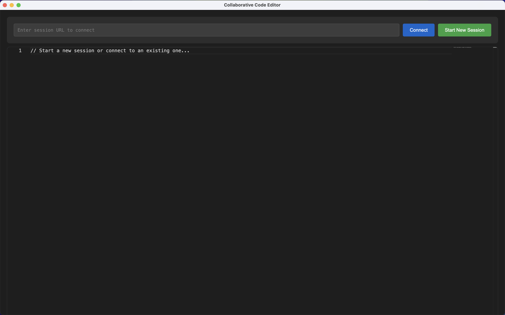

# Collaborative Code Editor

A real-time collaborative code editor desktop application built with Electron, Socket.IO, and Monaco Editor. This application allows multiple users to collaborate on code in real-time, making it perfect for pair programming, teaching, or remote collaboration.



## Features

- 🚀 Real-time code synchronization across multiple users
- 💻 Desktop application for macOS (Windows & Linux support coming soon)
- 🎨 Beautiful, modern interface with dark theme
- 📝 Monaco Editor (same as VS Code) with syntax highlighting
- 🔌 Easy session sharing with automatic port management
- 🔄 Instant connection status feedback
- 🎯 Simple and intuitive user interface

## Prerequisites

Before you begin, ensure you have the following installed:
- [Node.js](https://nodejs.org/) (v14.0.0 or higher)
- [npm](https://www.npmjs.com/) (v6.0.0 or higher)
- [Git](https://git-scm.com/) (for development)

## Installation

1. Clone the repository:
```bash
git clone https://github.com/yourusername/collaborative-code-editor.git
cd collaborative-code-editor/desktop-app
```

2. Install dependencies:
```bash
npm install
```

3. Start the development server:
```bash
npm start
```

## Building the Application

To build the application for distribution:

### macOS
```bash
npm run dist
```
This will create a `.dmg` file in the `dist` directory.

### Windows (Coming Soon)
```bash
npm run dist:win
```

### Linux (Coming Soon)
```bash
npm run dist:linux
```

## Project Structure

```
desktop-app/
├── main.js              # Electron main process
├── index.html          # Main application window
├── package.json        # Project configuration and dependencies
├── src/               # Source files
├── build/             # Build resources
└── dist/              # Compiled binaries
```

## Development

### Architecture

The application consists of three main components:

1. **Electron Main Process** (`main.js`)
   - Handles window management
   - Manages port allocation
   - Controls application lifecycle

2. **Frontend** (`index.html`)
   - User interface
   - Monaco Editor integration
   - Socket.IO client connection

3. **Socket.IO Server**
   - Real-time communication
   - Code synchronization
   - Session management

### Key Dependencies

- `electron`: Desktop application framework
- `socket.io`: Real-time communication
- `monaco-editor`: Code editor
- `express`: Web server for Socket.IO

### Development Workflow

1. Make changes to the source code
2. Test using `npm start`
3. Build using `npm run dist`
4. Test the built application

### Adding New Features

When adding new features:

1. Update the main process (`main.js`) if needed
2. Modify the frontend (`index.html`)
3. Test real-time functionality
4. Update documentation
5. Build and test the distribution

## Usage

### Starting a New Session

1. Launch the application
2. Click "Start New Session"
3. Share the displayed URL with collaborators

### Joining a Session

1. Launch the application
2. Paste the session URL
3. Click "Connect"

## Contributing

1. Fork the repository
2. Create a feature branch
3. Commit your changes
4. Push to the branch
5. Create a Pull Request

## Troubleshooting

### Common Issues

1. **Port Already in Use**
   - The application will automatically try alternative ports
   - Check if another instance is running

2. **Connection Issues**
   - Verify the URL is correct
   - Check your network connection
   - Ensure the host application is running

3. **Editor Not Loading**
   - Clear the application cache
   - Reinstall dependencies
   - Check console for errors

## Future Enhancements

- [ ] Windows and Linux support
- [ ] Multiple editor themes
- [ ] File system integration
- [ ] User cursors and selections
- [ ] Chat functionality
- [ ] Session persistence
- [ ] Custom language support
- [ ] Collaborative debugging

## License

This project is licensed under the ISC License - see the LICENSE file for details.

## Acknowledgments

- [Electron](https://www.electronjs.org/)
- [Monaco Editor](https://microsoft.github.io/monaco-editor/)
- [Socket.IO](https://socket.io/)

## Contact

For questions, suggestions, or issues, please open an issue in the GitHub repository.

---

Made with ❤️ by Md. Muhiminul Islam